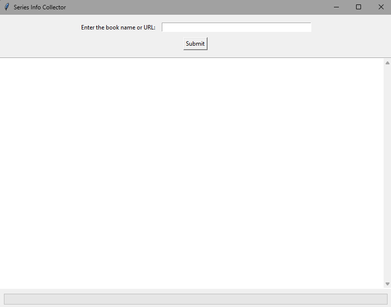
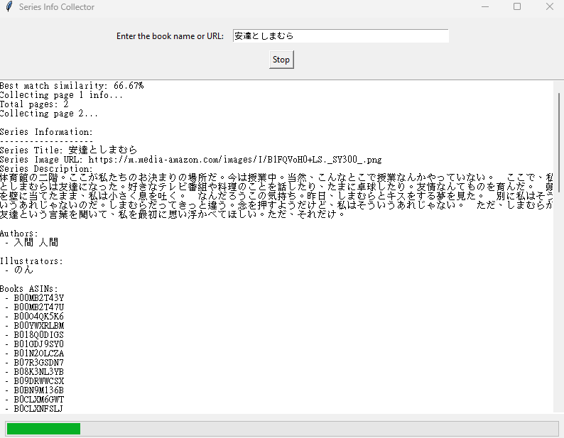

# Series Info Collector

This project is a tool to extract information about books and series from websites such as Amazon. The following steps will guide you through setting up and using the tool.

## Installation and Setup

1. **Install Python**
   
   Make sure Python is installed on your system. You can download it from [https://www.python.org/downloads/](https://www.python.org/downloads/).

2. **Run Setup Script**
   
   Double-click `setup.bat` to install all the necessary Python libraries and dependencies.

3. **Configure the Base URL**
   
   Update the `config.json` file with the base URL of the target site. For example:
   ```json
   {
       "baseurl": "http://www.amazon.co.jp/"
   }
   ```

4. **Launch the Application**
   
   Run `launch.bat` to start the application. This will open a GUI window:

   

## Usage

- The GUI allows you to search for books using their name, a direct book link, or a series link.
- Once a search is performed, the information is displayed in the GUI:

  

5. **Extract and Save HTML Output**
   
   After extraction, the data is saved in HTML format in the `/output` directory. The output format is displayed below:

   

## TODO

- Implement an auto-correction feature (using a language model or AI crawler) to prevent issues when the website source changes.
- Add functionality to grab books that belong to a series but do not have a dedicated series page.
- Enable extraction of R18 novels (this will require a Japanese IP and bypassing age verification).

Feel free to contribute to the project or report any issues you encounter!